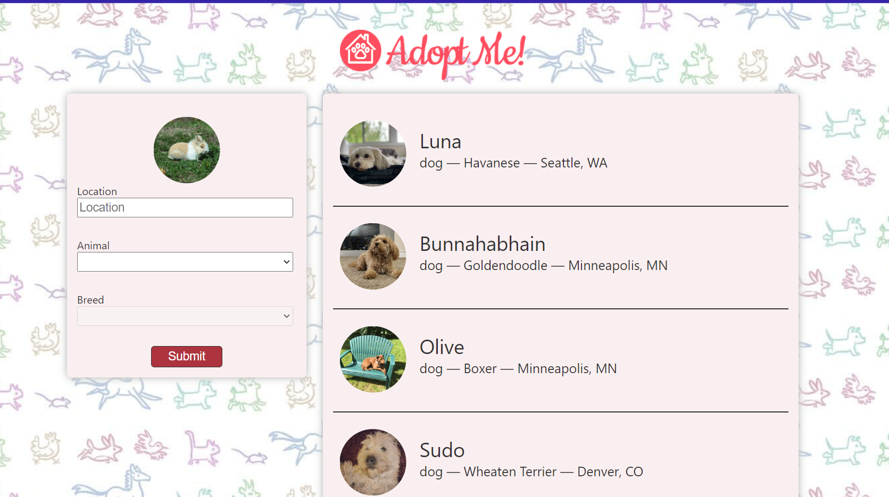
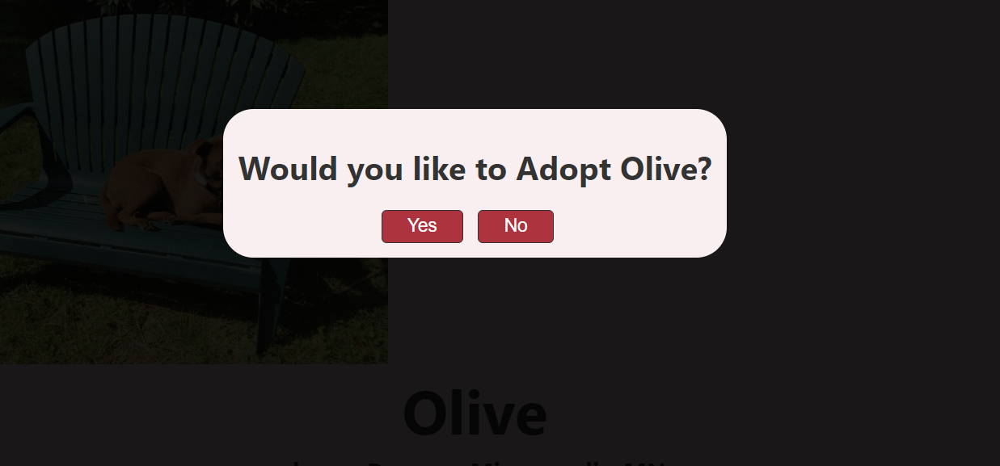

# Adopt-Pet-MK

## => Adopt-Pet-mk is a dynamic web application which helps in adopting variety of pets from different breeds.

## Website Link => https://adopt-pet-mk.vercel.app/

## Project's Screenshots =>





<h2>Getting Started</h2>

1. To get started with this project, you will need to have `Node.js` and `NPM` installed on your system.

2. First, you need to open a `Terminal` in your system and `Clone` this repository by using :

```bash
git clone https://github.com/Mk4Levi/Adopt-Pet-MK.git
```

3. Navigate to the Project's directory :

```bash
cd Adopt-Pet-MK
```

4. Install all Dependencies used in this Project :

```bash
npm install
```

7. Finally, host it on local server :

```bash
npm run dev
```

8. Now just search this link in your browser to view the live running application in your Local sysytem :

```bash
http://localhost:5173
```

<h2>Paths & Files</h2>

### Structure of the Folders & Files in this Repo :

```text
.
.
├── public/
├── src
│   ├── assets/
│   ├── components/
|         └── App.jsx
|         └── Carousel.jsx
|         └── Details.jsx
│         └── ErrorBoundary.jsx
│         └── Modal.jsx
│         └── Pet.jsx
|         └── Results.jsx
│         └── SearchParams.jsx
│         └── fetchBreedList.js
│         └── fetchPet.js
│         └── fetchSearch.js
│         └── useBreedList.js
│
│   ├── contexts/
|         └── AdoptedPetContext.jsx
│
│   ├──  css/
│         └── style.css
|
│   ├── index.jsx
|   ├── index.html
│   ├── vercel.json
│
├── .eslintrc.json
├── .gitattributes
├── .gitignore
├── package-lock.json
├── package.json
├── README.md
├── vite.config.js

```

# Thank You
